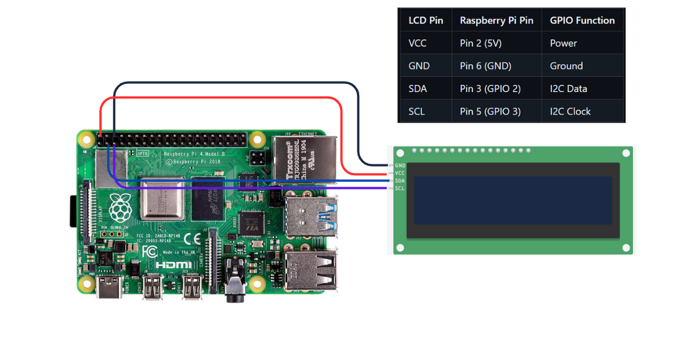

# 📟 Raspberry Pi LCD Dashboard

A simple and beginner-friendly **Python-based digital dashboard** using a **Raspberry Pi**, **I2C LCD (16x2 or 20x4)**, and system commands to display useful system info like IP address, CPU temperature, and RAM usage.

---

## 🔧 Components Used

- Raspberry Pi 4 (with Raspberry Pi OS)
- 16x2 or 20x4 LCD with I2C Backpack
- Jumper Wires
- Breadboard (optional)
- Git + Python 3

---

## 🔌 Wiring (I2C LCD to Raspberry Pi GPIO)

| LCD Pin | Raspberry Pi Pin | GPIO Function |
|---------|------------------|----------------|
| VCC     | Pin 2 (5V)       | Power           |
| GND     | Pin 6 (GND)      | Ground          |
| SDA     | Pin 3 (GPIO 2)   | I2C Data        |
| SCL     | Pin 5 (GPIO 3)   | I2C Clock       |



---

## 🖥️ What It Displays

- ✅ Raspberry Pi’s IP Address
- 🌡️ CPU Temperature
- 💾 RAM Usage

Each data point updates every 3 seconds in a loop.

---

## 📦 Dependencies

Install the required libraries:
```bash
sudo apt update
sudo apt install -y i2c-tools python3-smbus python3-pip
pip3 install RPLCD
```

---

## 🔍 Find I2C Address

Use this command:
```bash
i2cdetect -y 1
```
Look for addresses like `0x27` or `0x3f`.

---

## 💻 How to Run

1. Enable I2C:
```bash
sudo raspi-config
# → Interfacing Options → I2C → Enable
```

2. Run the code:
```bash
python3 lcd_dashboard.py
```

---

## 📁 Files Included

- `lcd_dashboard.py` – Main Python code
- `README.md` – Project documentation

---

## 🧠 How It Works

- Uses Linux system commands to fetch info
- Displays info using `RPLCD` library
- Refreshes the LCD screen every 3 seconds

---

## 🙌 Credits

This project was built and documented by [Adarsh Mecheril](https://github.com/AdarshMecheril)  
Inspired by open-source electronics and DIY learning.

---

## 📌 License

This project is open-source and available under the [MIT License](LICENSE).
